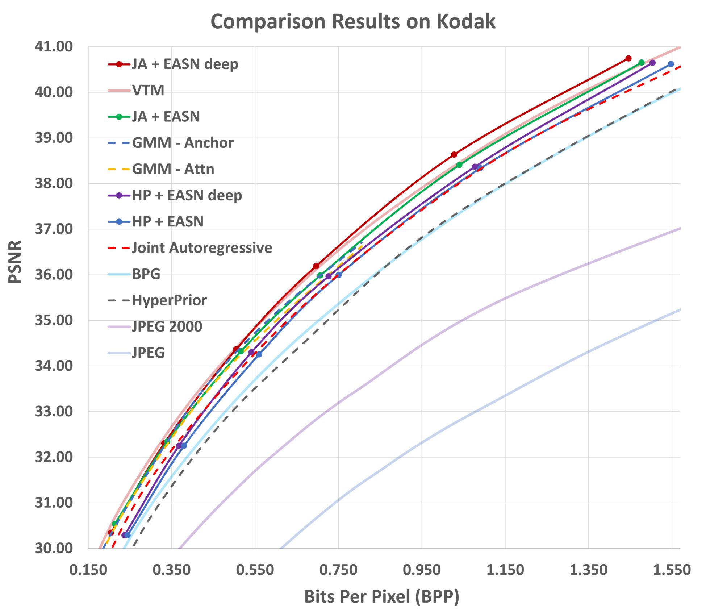

# Expanded Adaptive Scaling Normalization for End to End Image Compression



# Common Settings
Modify the following options in  **./options.yml**.
- use_cuda: True if using GPU
- gpu_idx: GPU index to use
- Model:  Model name to train / test.\
　　　  　*HP+EASN*, *HP+EASN-deep*, *JA+EASN*, *JA+EASN-deep* are available.
- ExperimentName: experimental result folder name.\
　　　  　　　　 　　 　If not exist, it will make new folder. 


<hr/>

# Training
## MSE distortion
Modify the following options in **./Model/"Model_Name"/config.yml**.
- mode:  'train' for training
- folder_dir:  dataset directory of train / val
- params:  pretrained parameter directory if exists.
- N: Channel number of N
- M: Channel number of M
- lmbda: rate-distortion tradeoff hyperparameter.
- distortion:  Distortion type. 'mse'


## MS-SSIM distortion
Modify the following options in **./Model/"Model_Name"/config.yml**.
- mode:  'train' for training
- folder_dir:  dataset directory of train / val
- params:  pretrained parameter directory of MSE distortion version.
- N: Channel number of N
- M: Channel number of M
- lr: Set 1e-5
- lmbda: rate-distortion tradeoff hyperparameter.
- load_optimizer: Set **False** for finetuning MSE distortion pretrained parameter.
- distortion:  Distortion type. 'ms-ssim'


<hr/>

# Test

## Pretrained Parameters:
Link: [Download](https://drive.google.com/drive/folders/1IlfH_E06dp_GUnqj3wWefacgARVKxmJ5?usp=sharing)


## Setting
For test dataset, we cut images to make the width and height multiple of 64 for all models including comparison models and traditional codec.  
Also, we have confirmed that zero padding is producing strange results with our pretrained weights.  
Please cut the test image to be a multiple of 64 in width and height, or utilize the method such as reflection padding.  

Modify the following options in **./Model/"Model_Name"/config.yml**.
- mode:  'test' for test
- folder_dir:  dataset directory of test
- params:  pretrained parameter directory.
- N: Channel number of N
- M: Channel number of M
- load_optimizer: Set False at 'test' stage for given pretrained parameters.


<hr/>

# Excecution
```
python main.py
```
